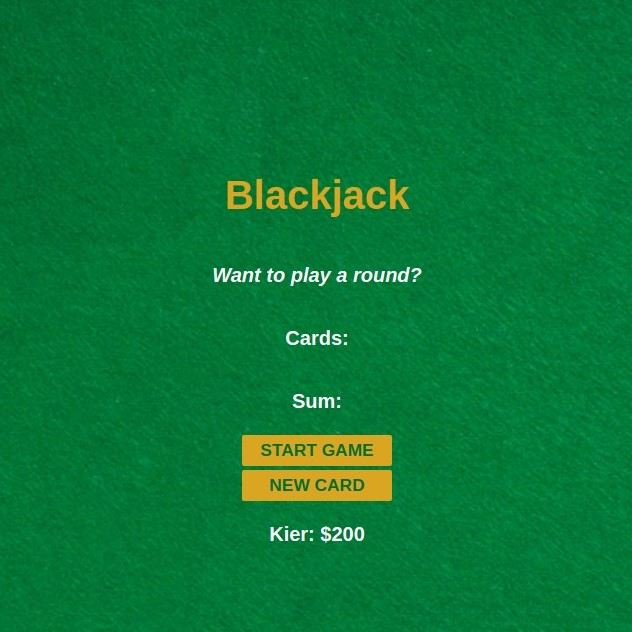
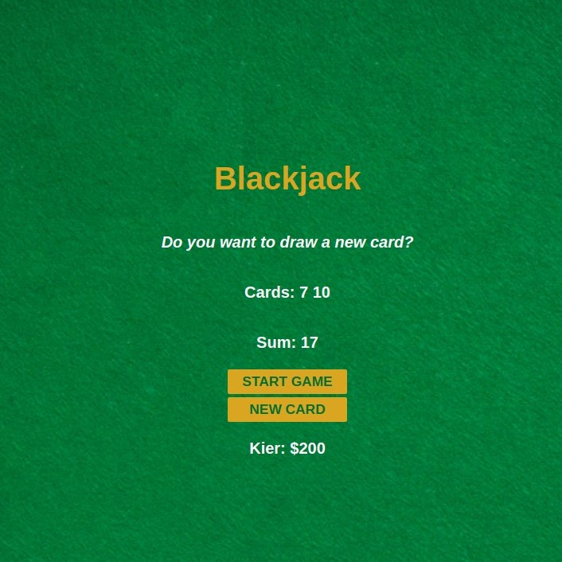

# Blackjack
Your first JavaScript game will be Blackjack, the iconic Casino game that's loved by millions.
## Table of contents
- [Introduction](#introduction)
- [Overview](#overview)
  - [Screenshot](#screenshot)
  - [Built using](#built-using)
  - [Lessons Learned](#lessons-learned)
- [Author](#author)
- [Acknowledgement](#acknowledgement)
## Introduction
- This is my solution to the second part of [Learn JavaScript](https://scrimba.com/learn/learnjavascript).
- This webpage is a blackjack game, with some functionalities such as:
    - Random number generator
    - Card Display
    - Sum Display
    - New Card Button
    - Booleans
    - Nonfunctional Player Data Display

## Overview
- Link: [github.com/kierhb/blackjack](https://github.com/kierhb/blackjack)

### Screenshot

### Built using

- HTML5 markup
- CSS
- Vanilla JavaScript

### Lessons Learned

- Adding conditional statements and reassigning variables.
- Applying array principles to cards.
- Applying loop for the sum.
- Using Math objects to generate cards.
- Using logical operators with boolean expressions such as triggering new cards when allowed.
- Introduction to JavaScript objects.

## Author

- GitHub - [@kierhb](https://github.com/kierhb)
- LinkedIn - [Kier Bobila](https://www.linkedin.com/in/kier-bobila/)

## Acknowledgement
I want to acknowledge one of the co-founders and CEO of [Scrimba](https://scrimba.com), the course instructor Per Harald Borgen and to all members of Scrimba community.